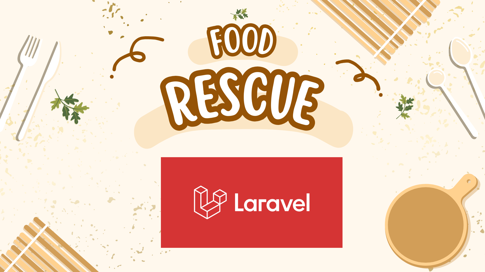

# RescueFood



RescueFood is a web application designed to facilitate the recovery and redistribution of surplus food from restaurants and retailers to charitable organizations. This project uses a robust stack for both frontend and backend functionality, providing a streamlined interface for managing food recovery and donation events.

## Technologies Used

- **Backend:** Laravel (PHP Framework)
- **Database:** MySQL
- **Frontend:** Blade templates integrated with Laravel

## Installation

1. **Clone the Repository:**

   ```bash
   git clone https://github.com/mohamedwassimennar/Food-Rescue-Project.git
Navigate to the Project Directory and Install Dependencies:

bash
Copier le code
cd RescueFood
composer install
npm install
Setup Environment Variables:

Create a .env file by copying the example provided:

bash
Copier le code
cp .env.example .env
Generate Application Key:

bash
Copier le code
php artisan key:generate
Run Database Migrations:

bash
Copier le code
php artisan migrate
Start the Development Server:

bash
Copier le code
php artisan serve
Contributors
The following individuals contributed to the development of RescueFood:

Nidhal Ennar
Said Atoui
Ahmed Gamgami
Chaima Idoudi
Project Features
Food Recovery Management: Schedule and manage food recovery events.
Organization Coordination: Facilitate communication and coordination between food providers and charities.
Data Security: Protect sensitive data related to donations and user information.
Contact
For further details or contributions, please feel free to contact the contributors through the GitHub repository.
